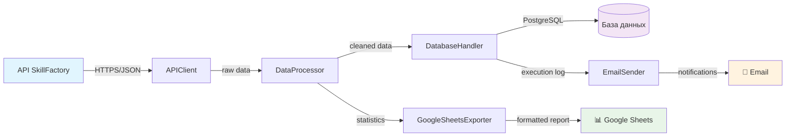

# 💡 SF ETL Data Pipeline

ETL (Extract, Transform, Load) пайплайн для обработки статистики использования образовательной платформы SkillFactory. Проект демонстрирует полный цикл работы с данными: от получения через API до визуализации и уведомлений.


## 📊 О проекте

Этот проект был разработан как финальное задание курса Python. Он решает реальную бизнес-задачу: интеграцию с API образовательной платформы, обработку статистики студентов, хранение данных в БД и предоставление аналитики через автоматизированные отчеты.

### Ключевые возможности:
- ✅ **Извлечение данных** из REST API с обработкой ошибок
- ✅ **Валидация и очистка** данных (парсинг JSON, проверка типов)
- ✅ **Хранение** в PostgreSQL с защитой от дубликатов
- ✅ **Автоматическая отчетность** в Google Sheets с форматированием
- ✅ **Уведомления** по email о результатах выполнения
- ✅ **Комплексное логирование** с rotation файлов

## 🏗️ Архитектура системы



## 🎯 Функциональность модулей

1. ProjectLogger (logger.py)

* Singleton-паттерн для глобального доступа к логгеру

* Запись DEBUG в файл, INFO+ в консоль

* Автоматическая ротация логов (хранение 3 дней)

* Форматирование с временными метками

2. APIClient (api_client.py)

* Получение данных с https://b2b.itresume.ru/api/statistics

* Обработка HTTP ошибок (timeout, connection, status codes)

* Парсинг вложенных JSON полей (passback_params)

* Поддержка параметров запроса (даты, клиентские ключи)

3. DataProcessor (data_processor.py)

* Валидация всех полей данных

* Преобразование типов (строки → datetime, числа → boolean)

* Статистический анализ (уникальные пользователи, успешность попыток)

* Расчет метрик для отчетности

4. DatabaseHandler (database_handler.py)

* Singleton для управления подключениями к PostgreSQL

* Автоматическое создание таблиц и индексов

* Batch-вставка с защитой от дубликатов (ON CONFLICT DO NOTHING)

* Ленивая инициализация соединения

5. GoogleSheetsExporter (google_sheets.py)

* Автоматическое создание листов и форматирование

* Настройка ширины колонок и заморозка заголовков

* Экспорт статистики с автоформатированием

* Поддержка Service Account аутентификации

6. EmailSender (email_sender.py)

* Отправка уведомлений через SMTP/SSL

* Форматирование статистики для email

* Определение времени выполнения из логов

* Три типа писем: успешное выполнение, с статистикой, ошибка

## 🚀 Быстрый старт

Предварительные требования:

* Python 3.9 или выше

* PostgreSQL 13+ (локально или удаленно)

* Аккаунт Google для Google Sheets API

* Почта с поддержкой SMTP (Gmail рекомендуется)

## Установка

```bash
# 1. Клонируйте репозиторий
git clone https://github.com/MarsHaveSent/sf_etl_plus_pj.git
cd sf-etl-processor

# 2. Создайте виртуальное окружение
python -m venv venv

# 3. Активируйте (Windows)
venv\Scripts\activate.bat
# Linux/Mac:
# source venv/bin/activate

# 4. Установите зависимости
pip install -r requirements.txt
```
## Конфигурация 
```bash
# 1. Скопируйте шаблон настроек
cp .env.example .env

# 2. Отредактируйте .env файл:
# - Настройки базы данных (PostgreSQL)
# - Ключи API
# - Данные для Google Sheets
# - Настройки email
```

### 🔓 Пример .env файла: 

```env
# === API НАСТРОЙКИ ===
API_CLIENT=Skillfactory
API_CLIENT_KEY=M2MGWS
START_DATE=2023-04-01 00:00:00
END_DATE=2023-04-02 00:00:00

# === БАЗА ДАННЫХ ===
DB_HOST=localhost
DB_NAME=sf_stats
DB_USER=postgres
DB_PASSWORD=ваш_пароль
DB_PORT=5432

# === GOOGLE SHEETS ===
GOOGLE_CREDENTIALS_FILE=config/credentials.json
GOOGLE_SPREADSHEET_ID=ваш_spreadsheet_id

# === EMAIL ===
EMAIL_FROM=ваш_email@mail.ru
EMAIL_PASSWORD=ваш_app_password
EMAIL_SMTP_SERVER=smtp.mail.ru
EMAIL_SMTP_PORT=465
EMAIL_TO=получатель@example.com

# === НАСТРОЙКИ СКРИПТА ===
BATCH_SIZE=100
```

## Настройка Google Sheets API

1. Создайте проект в [Google Cloud Console](https://console.cloud.google.com/welcome)

2. Включите Google Sheets API

3. Создайте Service Account и скачайте credentials.json

4. Положите файл в папку config/

5. Дайте доступ к таблице для email сервисного аккаунта

## Запуск
```bash
# Запустите основной скрипт
python src/main.py
```

## 📊 Пример выходных данных

### База данных
Таблица student_attempts со структурой:
```sql
user_id | oauth_consumer_key | lis_result_sourcedid | is_correct | attempt_type | created_at
--------|-------------------|---------------------|------------|--------------|------------
abc123  |                   | course-v1:...       | true       | submit       | 2023-04-01 10:30:00
```

### Google Sheets 
Автоматически созданная таблица с:

* Заголовком "SF Statistics Dashboard"

* Форматированными колонками

* Статистикой за каждый запуск

* Замороженными заголовками

### Email уведомление 

```text
Отчет о выполнении скрипта

Скрипт: SF ETL Processor
Статус: УСПЕШНО ЗАВЕРШЕН
Время начала: 2023-12-15 14:30:00
Продолжительность: 00:55:23

ОСНОВНЫЕ МЕТРИКИ:
----------------------------
Всего записей: 8,226
Уникальных пользователей: 266
Submit попыток: 3,986
Run попыток: 4,240
Корректных: 1,302
Некорректных: 6,924
Процент успешных: 32.66%
```

## 🔧 Технические детали

### Паттерны проектирования

* Singleton: ProjectLogger, DatabaseHandler

* Factory Method: Создание объектов конфигурации

* Builder: Построение сложных объектов (Email, Sheets)

* Strategy: Разные стратегии обработки данных

### Обработка ошибок

* Многоуровневая обработка исключений

* Логирование всех ошибок с деталями

* Грейсфул деградация (продолжение при ошибках в batch)

* Автоматические уведомления об ошибках

### Производительность

* Batch обработка данных (по 100 записей)

* Индексы в PostgreSQL для быстрого поиска

* Ленивая инициализация ресурсов

* Кэширование подключений

### 📈 Возможности для расширения

1. Добавление новых источников данных

2. Реализация планировщика задач (cron, Airflow)

3. Интеграция с BI-инструментами (Power BI, Tableau)

4. Веб-интерфейс для мониторинга

5. REST API для управления пайплайном

6. Docker-контейнеризация

### 👥 Участие в разработке

1. Форкните репозиторий

2. Создайте ветку для вашей функции (git checkout -b feature/AmazingFeature)

3. Закоммитьте изменения (git commit -m 'Add some AmazingFeature')

4. Запушьте в ветку (git push origin feature/AmazingFeature)

5. Откройте Pull Request

### 🙏 Благодарности

* Команде Simulative за предоставление API

* Команде SkillFactory за предоставление данных

* Разработчикам библиотек: requests, psycopg2, gspread

* Сообществу Python за отличную документацию
